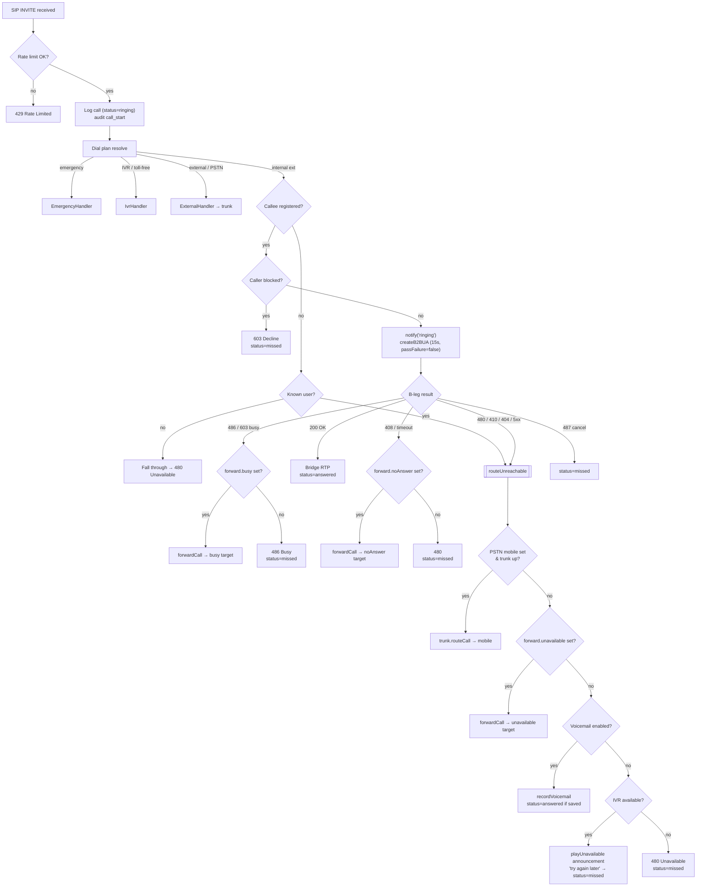
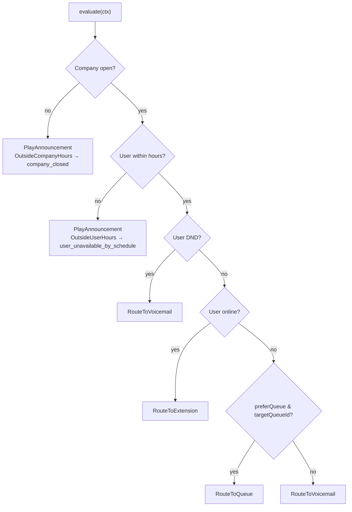
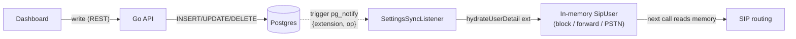
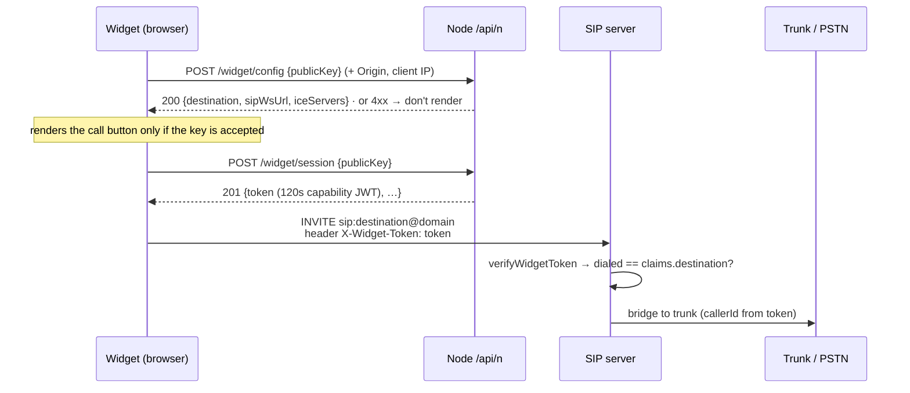

# Enjoys Voice — Architecture

## System Overview

```
┌─────────────────────────────────────────────────────────────────────┐
│                         Browser (Web UI)                             │
│  ┌──────────┐  ┌───────────┐  ┌──────────────┐  ┌──────────────┐  │
│  │ SIP.js   │  │ WebSocket │  │  HTTP/REST   │  │  Web Audio   │  │
│  │ (calls)  │  │ (presence)│  │  (API calls) │  │  (tones)     │  │
│  └────┬─────┘  └─────┬─────┘  └──────┬───────┘  └──────────────┘  │
└───────┼───────────────┼───────────────┼────────────────────────────┘
        │ WS:5065       │ WS:3002       │ HTTP:3001
        ▼               ▼               ▼
┌─────────────────────────────────────────────────────────────────────┐
│                      Backend (Bun + TypeScript)                       │
│                                                                       │
│  ┌────────────────┐  ┌────────────────┐  ┌────────────────────────┐ │
│  │  SIP Server    │  │  Signaling WS  │  │  HTTP API Server       │ │
│  │  (sip.server)  │  │  (signaling)   │  │  (express)             │ │
│  └───────┬────────┘  └────────────────┘  └────────────────────────┘ │
│          │                                                            │
│  ┌───────┴────────────────────────────────────────────────────────┐  │
│  │                     Services Layer                              │  │
│  │  ┌──────────┐ ┌──────────────┐ ┌───────┐ ┌──────────────────┐ │  │
│  │  │ Database │ │ Registration │ │ Trunk │ │    IVR System    │ │  │
│  │  │ Service  │ │    Store     │ │Service│ │                  │ │  │
│  │  └──────────┘ └──────┬───────┘ └───────┘ └──────────────────┘ │  │
│  │                       │ (adapter)                               │  │
│  │              ┌────────┴────────┐                                │  │
│  │              │ Memory │ Redis  │                                │  │
│  │              └─────────────────┘                                │  │
│  └────────────────────────────────────────────────────────────────┘  │
└──────────────────────────────┬───────────────────────────────────────┘
                               │ TCP:9022 (control)
                               ▼
┌─────────────────────────────────────────────────────────────────────┐
│                     Docker Infrastructure                             │
│                                                                       │
│  ┌─────────────────┐          ┌─────────────────────────────────┐   │
│  │ Drachtio Server │◄────────►│   FreeSWITCH (drachtio-mrf)    │   │
│  │  SIP Proxy/B2B  │          │   Media/IVR/Tones/Recording    │   │
│  │  Port: 5060/5065│          │   Port: 8021 (ESL)             │   │
│  └─────────────────┘          └─────────────────────────────────┘   │
└─────────────────────────────────────────────────────────────────────┘
```

> **Local vs prod transport:** in dev the browser uses plain SIP-over-WS on `:5065`.
> In production Caddy is the single HTTPS entrypoint and the browser uses
> `wss://voice.enjoys.in/sip`; Caddy re-encrypts to drachtio's real-TLS WSS listener
> on `:5066` (drachtio terminates TLS so the transport matches SIP.js's
> `Via: SIP/2.0/WSS`). The `:9022` control socket is server-to-server only.

> **API response envelope:** both back-ends return `{ success, message, data }`.
> Go via `server/internal/response`, Node via `src/http/response.ts`, and the web
> client unwraps `.data` in `web/app/lib/api.ts`. New to the stack? See
> [LEARNING.md](LEARNING.md).

## Call Flow: Outbound (Alice → Bob)

```
Alice Browser          Backend (SipServer)         Drachtio        Bob Browser
     │                        │                       │                  │
     │  1. SIP INVITE        │                       │                  │
     │  (via WS:5065)        │                       │                  │
     │───────────────────────►│                       │                  │
     │                        │  2. handleInvite()    │                  │
     │                        │  - parse caller/callee│                  │
     │                        │  - check block list   │                  │
     │                        │  - log call           │                  │
     │                        │                       │                  │
     │                        │  3. routeToExtension()│                  │
     │                        │  - lookup registration│                  │
     │                        │  - extract contact URI│                  │
     │                        │                       │                  │
     │  ◄── WS notify ───────│  4. notify('ringing') │                  │
     │  (UI plays caller tune)│                       │                  │
     │                        │                       │                  │
     │                        │  5. createB2BUA()     │                  │
     │                        │──────────────────────►│                  │
     │                        │                       │  6. INVITE       │
     │                        │                       │  (via WS conn)   │
     │                        │                       │─────────────────►│
     │                        │                       │                  │
     │                        │                       │  7. 180 Ringing  │
     │                        │                       │◄─────────────────│
     │                        │                       │                  │
     │                        │                       │                  │ (UI plays ringtone)
     │                        │                       │                  │
     │                        │                       │  8a. 200 OK      │
     │                        │                       │◄─────────────────│ (Bob answers)
     │                        │  9. B2BUA bridges     │                  │
     │  ◄── WS notify ───────│  notify('answered')   │                  │
     │  (stops caller tune)   │                       │                  │
     │                        │                       │                  │
     │◄═══════════════════════╪═══ RTP MEDIA (audio) ═╪═════════════════►│
     │                        │                       │                  │
     │                        │       ── OR ──        │                  │
     │                        │                       │                  │
     │                        │                       │  8b. 486/603     │
     │                        │                       │◄─────────────────│ (Bob declines)
     │                        │  catch: status=486    │                  │
     │                        │  - check forwarding   │                  │
     │  ◄── WS notify ───────│  notify('declined')   │                  │
     │  (plays busy tone)     │                       │                  │
     │                        │                       │                  │
     │                        │       ── OR ──        │                  │
     │                        │                       │                  │
     │                        │  8c. timeout (15s)    │                  │
     │                        │  catch: status=408    │                  │
     │                        │  - check forwarding   │                  │
     │  ◄── WS notify ───────│  notify('no_answer')  │                  │
     │  (plays busy tone)     │                       │                  │
```

## File → Function → Flow

### Making a Call

| Step | File | Function | What Happens |
|------|------|----------|--------------|
| 1 | `web/app/hooks/useSipPhone.ts` | `makeCall()` | Creates SIP.js `Inviter`, sends INVITE over WS |
| 2 | `src/sip/sip.server.ts` | `handleInvite()` | Receives INVITE via drachtio-srf |
| 3 | `src/sip/sip.server.ts` | `routeToExtension()` | Checks block list, builds route, calls B2BUA |
| 4 | `src/sip/sip.server.ts` | `srf.createB2BUA()` | Bridges A-leg (caller) to B-leg (callee) |
| 5 | `web/app/hooks/useSipPhone.ts` | `onInvite` delegate | Callee's browser receives incoming INVITE |
| 6 | `web/app/hooks/useSipPhone.ts` | `answerCall()` | Callee accepts → `session.accept()` |
| 7 | `web/app/hooks/useSipPhone.ts` | `hangUp()` | Either side hangs up → `session.bye()` |

### Registration

| Step | File | Function | What Happens |
|------|------|----------|--------------|
| 1 | `web/app/hooks/useSipPhone.ts` | `connect()` | Creates UserAgent + Registerer |
| 2 | `src/sip/sip.server.ts` | `handleRegister()` | Validates user, stores in registration store |
| 3 | `src/services/registration/` | `store.register()` | Persists contact + source (memory or redis) |
| 4 | `src/websocket/signaling.server.ts` | `broadcastPresence()` | Notifies all online users |

### Inbound Call Decision Flow (calling → receiving, start to end)

Every INVITE runs through one decision tree. Routing settings (block list, call
forwarding, PSTN forwarding) are read from the **in-memory** `SipUser` — never
the DB on the call path — and are kept fresh by the settings-sync listener (see
[Live Data Sync](#live-data-sync-listennotify)).



#### Stage-by-stage

| # | Decision | File · Function | Outcome |
|---|----------|-----------------|---------|
| 1 | Rate limit | `sip.server.ts` · `handleInvite()` | over limit → `429`; else continue |
| 2 | Log + classify | `sip.server.ts` · `handleInvite()` → `dialPlan.resolve()` | row logged `ringing`; routed to a handler by number shape |
| 3 | Registered? | `internal.handler.ts` · `handle()` | registered → step 4; offline known user → `routeUnreachable`; unknown → fall through (`480`) |
| 4 | **Block** | `sip.server.ts` · `routeToExtension()` → `db.isBlocked()` | blocked → `603 Decline`, `missed`; else ring |
| 5 | Ring (B2BUA) | `sip.server.ts` · `createB2BUA({timeout:15000, passFailure:false})` | `200` → bridge RTP, `answered` |
| 6 | **Busy** | `routeToExtension()` catch (`486/603`) → `db.getForwarding().busy` | target set → `forwardCall()`; else `486`, `missed` |
| 7 | **No answer** | `routeToExtension()` catch (`408`/timeout) → `getForwarding().noAnswer` | target set → `forwardCall()`; else `480`, `missed` |
| 8 | Cancelled | `routeToExtension()` catch (`487`) | `missed` only |
| 9 | **Unreachable** | `routeToExtension()` catch (`480/410/404/5xx/transport`) → `routeUnreachable()` | runs the fallback chain below |

#### `routeUnreachable` fallback chain (offline **and** stale-registration `410`)

Tried in order; the first that applies wins. The call is always recorded
`missed` unless PSTN or voicemail actually answers.

| Order | Condition | File · Function | Result |
|-------|-----------|-----------------|--------|
| 1 | `mobile` set **and** trunk up | `sip.server.ts` · `routeUnreachable()` → `trunk.routeCall()` | ring user's **PSTN mobile**; `answered`/`missed` |
| 2 | `forward.unavailable` set | → `forwardCall()` | forward to another extension |
| 3 | `config.voicemail.enabled` | → `ivr.recordVoicemail()` | caller leaves **voicemail**; `answered` if saved |
| 4 | IVR/media available | → `ivr.playUnavailable()` | spoken **"unavailable, try later"** announcement, then hang up; `missed` |
| 5 | none of the above | → `res.send(480)` | plain `480 Unavailable`; `missed` |

> The B2BUA uses `passFailure: false` so the callee's failure (e.g. a `410 Gone`
> from a stale registration) does **not** close the caller's leg — keeping it open
> lets steps 3–4 answer the caller for voicemail or the announcement.

## Routing & Availability (business hours + user schedules)

A reusable, framework-agnostic module under `src/modules/routing/` centralises
the "should this call connect right now?" decision so the SIP/IVR handlers no
longer hard-code schedule logic. It follows a clean/hexagonal layout:

| Layer | Path | Responsibility |
|-------|------|----------------|
| Domain | `domain/{entities,value-objects,enums}` | `RoutingContext`, `RoutingDecision`, `DecisionType`, `UnavailableReason` — plain types, no I/O |
| Contracts | `contracts/` | Repository/provider interfaces (`AvailabilityRepository`, `BusinessHoursRepository`, `PresenceProvider`, `UserProfileRepository`) |
| Services | `services/` | `AvailabilityService`, `BusinessHoursService`, `PresenceService`, `RoutingPolicyService` build a policy snapshot |
| Engine | `services/RoutingDecisionEngine.ts` | **Pure**, side-effect-free decision tree (`decide(ctx, policy)`) |
| Application | `application/RoutingOrchestrator.ts` | Facade: loads the user profile, builds the policy snapshot, calls the engine — `evaluate(ctx)` |
| Infrastructure | `infrastructure/{postgres,adapters}` | `Pg*Repository` + `DatabasePresenceProvider` (wraps the registration store) |

### Decision order (engine)



> **Backward-compatible by default.** No business-hours policy ⇒ always open; no
> user-availability windows ⇒ always available. With nothing configured the
> engine never emits `PlayAnnouncement`, so existing call flows are unchanged.

### Where it's wired in

| Call path | File · Function | Gate |
|-----------|-----------------|------|
| Internal extension | `internal.handler.ts` · `handle()` | Consults `routing.evaluate({…, targetExtension})`; a `PlayAnnouncement` decision plays the mapped prompt and ends the call (`missed`) before the registration/ring logic |
| Queue entry | `queue.handler.ts` · `handle()` | Pre-enqueue: business-hours gate (`company_closed`) **+** a distinct no-agents-online gate via `QueueService.agentAvailability()` (`no_agents_online`); "all agents busy" stays the existing hold/timeout prompt |
| IVR transfer node | `ivr.system.ts` · `flowTransfer()` | A flow `transfer` targets a department queue, so an `OutsideCompanyHours` decision plays `company_closed` on the live endpoint and returns `announced` (the flow runner then tears the leg down as `missed`) instead of parking on hold music |

All gates wrap the orchestrator call in try/catch and log-and-continue on error,
so a routing fault can never break a call.

### Prompt mapping

`constants/TtsPrompts.ts` is the single source of announcement wording. Each
`RoutingDecision.announcementKey` maps to a `say:`-prefixed prompt via
`ANNOUNCEMENT_PROMPTS`; `announcementText(key)` strips the prefix for callers
(like `playUnavailable`) that re-add the engine prefix themselves.

| Key | Prompt |
|-----|--------|
| `company_closed` | "Our company is currently closed…" |
| `user_unavailable_by_schedule` | "The person you are trying to reach is currently unavailable…" |
| `user_unreachable` | "…leave a message after the beep." |
| `all_agents_busy` | "All of our agents are currently busy…" |
| `no_agents_online` | "No agents are currently online…" |

### Schedule storage & admin API

The Go API owns schedule persistence (SQL migration `005_routing_hours_and_availability.sql`).
All schedule **writes are admin-only** (the `ADMIN_EXTENSIONS` allow-list); reads
stay open to authenticated users. The Next.js admin **Working Hours** tab
(`web/app/admin/components/HoursTab.tsx`) drives both editors.

| Method · Route | Auth | Purpose |
|----------------|------|---------|
| `GET /business-hours` | authenticated | Read the single global business-hours policy |
| `PUT /business-hours` | **admin** | Replace timezone + enabled + weekly windows |
| `GET /availability/:ext` | authenticated | Read a user's availability windows |
| `PUT /availability/:ext` | **admin** | Replace a user's timezone + windows |

| Table (migration 005) | Key columns |
|-----------------------|-------------|
| `business_hours_policies` | `timezone`, `enabled` (single global row) |
| `business_hours_windows` | `policy_id`, `day_of_week` (0–6), `start_minute`/`end_minute` (0–1440) |
| `user_availability_windows` | `extension`, `day_of_week`, `start_minute`/`end_minute`, `timezone`, `enabled` |

## Live Data Sync (LISTEN/NOTIFY)

The Go API owns all persistent writes (users + per-user settings). The Node SIP
engine serves every call from its **in-memory** store, so it mirrors those tables
and keeps them fresh in near real time via Postgres `LISTEN/NOTIFY` — no polling,
no per-call DB reads. Both listeners share one self-healing base
(`PgNotifyListener`: dedicated client, exponential-backoff reconnect, idempotent
trigger re-install + re-hydrate on every connect).

| Listener | File | Channel · Tables | On change → |
|----------|------|------------------|-------------|
| User sync | `postgres/notify.ts` | `users_changed` · `users` | `db.syncUser(ext)` — refresh identity, or remove on delete |
| Settings sync | `postgres/settings-notify.ts` | `settings_changed` · `blocked_numbers`, `forwarding_rules`, `user_settings` | `db.hydrateUserDetail(ext)` — reload **only that user's** block / forward / PSTN detail |



So: a user toggles **block** or **PSTN forwarding** in the dashboard → Go writes
the row → the table trigger NOTIFYs the affected extension → Node reloads just
that user into memory → the **next** call routes with the new setting, with no
restart and no DB hit on the call path. Because NOTIFY is broadcast to every
connected listener, this stays correct across multiple Node instances; each keeps
its own memory in step (so a separate Redis settings cache isn't required —
Valkey is already used for the registration store and the write-behind queue).


## Click-to-Call Widget (developer API keys)

A third-party site embeds a one-line `<script>` (or the `@enjoys/voice-widget`
npm package). A visitor clicks a button and talks — in the browser, over WebRTC —
to **one fixed destination**, with no login. Access is gated by an **API key
bound to allowed domains (`Origin`) + an IP allowlist**.

Because SIP REGISTER is **existence-only** (no password check), trust is enforced
at the two layers we own — an HTTP **capability-token mint** and the **SIP INVITE**:



- **Go** (`/api/g/api-keys`, owner-scoped) issues/revokes keys; create returns the
  `pk_live_…` + `sk_live_…` pair once. Secret stored as **SHA-256** so Node can
  verify server-to-server (`POST /widget/token`) without a shared bcrypt dep.
- **Node** validates `publicKey` + `Origin` + real client IP (needs
  `trust proxy`), mints the short-lived widget JWT, and `WidgetHandler` enforces
  the locked destination at INVITE time.
- The dashboard's **API Keys** tab manages keys and shows copy-paste embed
  snippets; the built IIFE is served from `web/public/widget.js`.


## Key Config (env vars)

| Variable | Default | Purpose |
|----------|---------|---------|
| `DRACHTIO_HOST` | `127.0.0.1` | Drachtio server address |
| `DRACHTIO_PORT` | `9022` | Drachtio control port |
| `DRACHTIO_SECRET` | `siprocks` | Drachtio auth secret |
| `FREESWITCH_HOST` | `127.0.0.1` | FreeSWITCH ESL host |
| `FREESWITCH_PORT` | `8021` | FreeSWITCH ESL port |
| `FREESWITCH_SECRET` | `JambonzR0ck$` | FreeSWITCH ESL password |
| `REDIS_URL` | — | Set for Redis registration store |
| `SIP_DOMAIN` | `localhost` | SIP domain (e.g. enjoys.in) |
| `HTTP_PORT` | `3001` | REST API port |
| `WS_PORT` | `3002` | WebSocket signaling port |
| `SIP_WS_PORT` | `5065` | SIP WebSocket port (via drachtio) |
| `WIDGET_ENABLED` | `true` | Enable the click-to-call widget endpoints (`/api/n/widget/*`) |
| `PUBLIC_SIP_WS_URL` | — | `wss://` URL the widget's SIP.js client connects to |
| `PUBLIC_ICE_SERVERS` | — | JSON array of ICE servers handed to the widget (defaults to a public STUN) |
| `ADMIN_EXTENSIONS` | — | Comma-separated allow-list of extensions permitted to perform admin writes (incl. business hours + user availability) — Go API |
