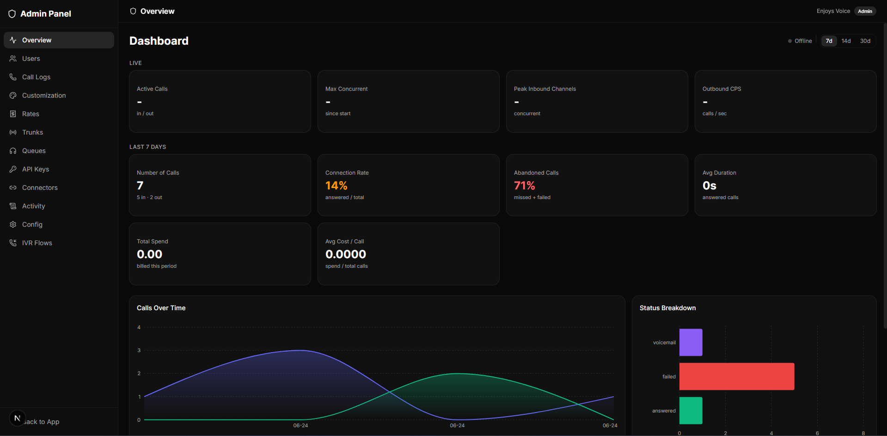
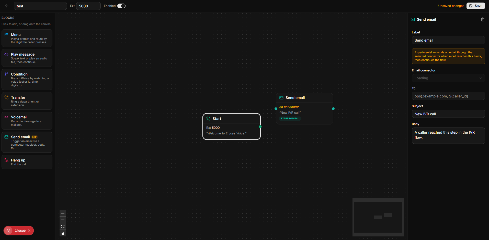
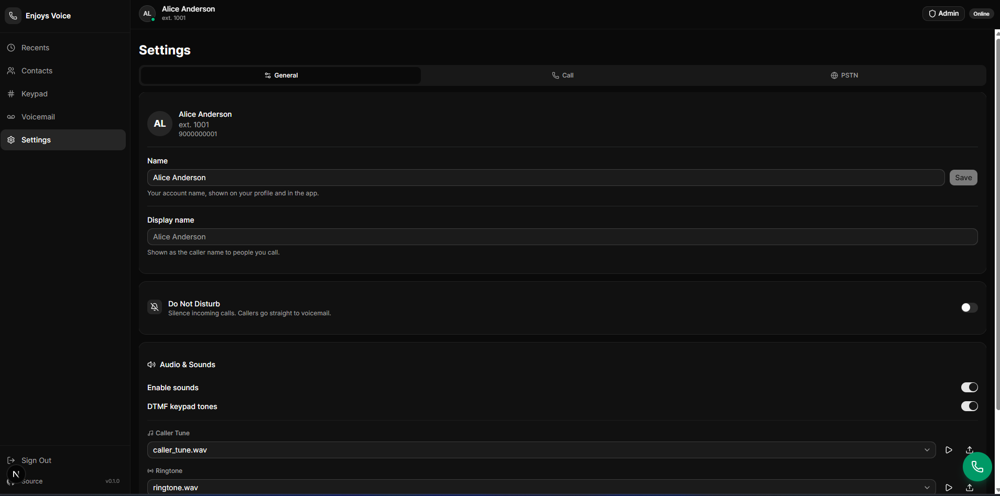
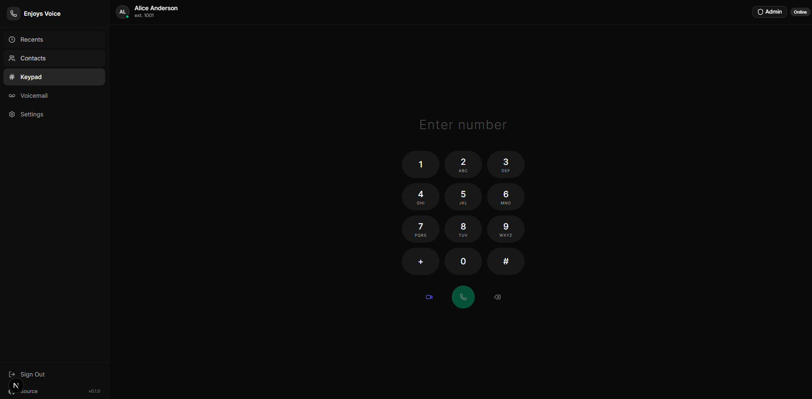
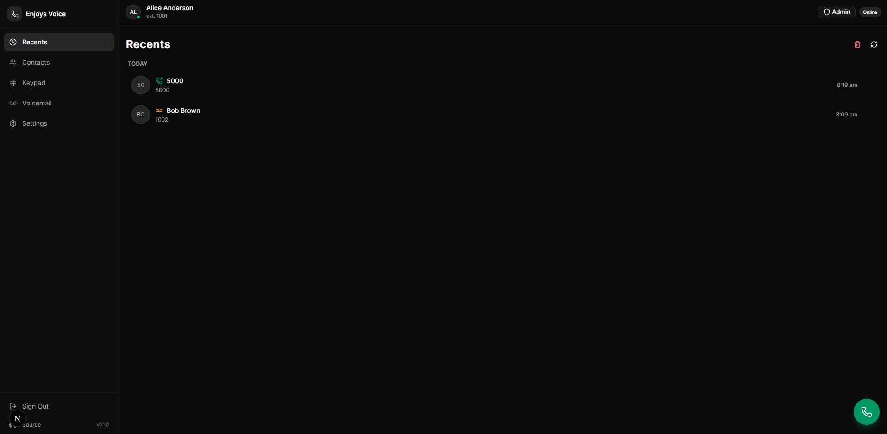

# Enjoys Voice — WebRTC Phone System

Real browser-based phone calls with microphone audio, an IVR flow builder, voicemail,
call recording, and SIP trunking for PSTN. Third-party sites can embed an API-key-gated
**click-to-call widget** (`@enjoys/voice-widget`) for browser WebRTC calls to a fixed destination.

## Screenshots

**Admin Dashboard** — live engine metrics (active calls, max concurrency, peak inbound channels, outbound CPS) plus last-N-days call volume, connection / abandon rates, spend, and the Calls-Over-Time and Status-Breakdown charts.



**IVR Flow Builder** — drag-and-drop call-flow canvas, persisted in Postgres. Shown here with the experimental **Send email** node that fires an email through a connector when a call reaches the block.



**Settings** — per-user profile, display name, Do Not Disturb, and audio preferences (caller tune, ringtone, DTMF tones).



**Dial Pad** — DTMF keypad for placing WebRTC calls to extensions or PSTN numbers, with audio and video call buttons.



**Recents** — recent call history grouped by day, with direction / voicemail icons and timestamps.



## Architecture

A **hybrid backend**: a Bun/TypeScript SIP engine owns the live telephony, a Go REST
API owns authentication and durable data, and two clients talk to both — a Next.js PWA
(`web/`) and a native Flutter softphone (`mobile/`, iOS + Android). Postgres is the
shared database; Valkey/Redis is the shared cache.

```
                         ┌─────────────────────────────┐
                         │      Browser (Web PWA)       │
                         │   Next.js 15 · React 19      │
                         │   SIP.js · WebRTC · Zustand  │
                         └───┬─────────┬─────────┬──────┘
            SIP over WS:5065 │  WS:3002│ HTTP    │ HTTP
            (media/calls)    │ (signal)│ :3001   │ :3003
                             ▼         ▼         ▼
            ┌────────────────────────────────┐ ┌────────────────────┐
            │   Node SIP Engine (Bun/TS)     │ │   Go REST API      │
            │   • SIP signalling + routing   │ │   • Auth / JWT     │
            │   • Presence, live call status │ │   • Account mgmt   │
            │   • IVR runtime, recording     │ │   • IVR flow store │
            │   • Voicemail capture          │ │   • Shared CRUD    │
            │   HTTP :3001 · WS :3002        │ │   HTTP :3003       │
            └───────┬────────────────────────┘ └─────────┬──────────┘
                    │ TCP:9022 (control)                  │
                    ▼                       ┌─────────────┴───────────┐
            ┌───────────────┐  ┌──────────┐ │ Postgres :5432          │
            │   Drachtio    │◄►│FreeSWITCH│ │ Valkey/Redis :6379      │
            │  SIP proxy    │  │  media   │ │ (shared by both back-   │
            │  5060 / 5065  │  │ 8021 ESL │ │  ends)                  │
            └───────────────┘  └──────────┘ └─────────────────────────┘
```

### Who owns what

| Concern | Service | Port |
|---|---|---|
| Auth (login / signup / refresh / `me` / rename) | **Go API** | 3003 |
| IVR flow builder persistence | **Go API** | 3003 |
| Account / settings CRUD (shared Postgres) | **Go API** | 3003 |
| SIP signalling, call routing, presence | **Node engine** | SIP 5060/5065 |
| Live status, users, call history (recents) | **Node engine** | HTTP 3001 |
| Presence / call-event signalling, recording relay | **Node engine** | WS 3002 |
| IVR runtime, voicemail capture | **Node engine** | — |
| Developer API keys (issue / revoke, owner-scoped) | **Go API** | 3003 |
| Click-to-call widget endpoints (`/widget/*`, key+Origin+IP gated) | **Node engine** | HTTP 3001 |
| Web UI (PWA) | **Next.js** | 3000 |

## Tech Stack

- **Node engine** (`src/`) — Bun, TypeScript, Express, `ws`, drachtio-srf / drachtio-fsmrf, `pg`, `redis`
- **Go API** (`server/`) — Go, gin, gorm, go-redis, golang-jwt, bcrypt
- **Web** (`web/`) — Next.js 15, React 19, SIP.js, Zustand, Tailwind, shadcn/ui
- **Mobile** (`mobile/`) — Flutter (Dart), `sip_ua` (SIP-over-WS) + `flutter_webrtc`, CallKit / ConnectionService, Firebase push
- **Widget** (`packages/voice-widget/`) — `@enjoys/voice-widget`, TypeScript, SIP.js, tsup (embeddable click-to-call bundle)
- **Infra** — Postgres, Valkey/Redis, Drachtio, FreeSWITCH (via Docker)

> Both back-ends speak the **same JSON envelope** — `{ success, message, data }`.
> Go via `server/internal/response`, Node via `src/http/response.ts`.

## Ports

> Host ports for the datastores are **shifted** (5432 / 6379 were already in use on
> the host) and bound to **loopback only**. Containers still use the standard ports
> internally; only the host-published port differs.

### Application services

| Port | Service | Env var | Proto | Notes |
|------|---------|---------|-------|-------|
| 4500 | Web UI (Next.js) | `next -p 4500` | TCP | `web/` frontend |
| 3001 | Node HTTP API (live status, calls, voicemail) | `HTTP_PORT` | TCP | |
| 3002 | Node WebSocket (signalling) | `WS_PORT` | TCP/WS | |
| 3004 | Node media-stream WS (Twilio Media Streams) | `MEDIA_STREAM_WS_PORT` | TCP/WS | only when `MEDIA_STREAM_ENABLED=true` |
| 3005 | Browser-bridge WS (PSTN → browser listen/talk) | `MEDIA_STREAM_BRIDGE_PORT` | TCP/WS | bridge mode only |
| 3003 | Go REST API (auth, IVR, CRUD) | `PORT` | TCP | host + container 3003 |
| 8085 | FreeSWITCH outbound-ESL listener (Node binds) | `FREESWITCH_LISTEN_PORT` | TCP | IVR media control |

### Datastores (`docker/docker-compose.dev.yml`, loopback-only)

| Host port | Container port | Service | Env var |
|-----------|----------------|---------|---------|
| 5442 | 5432 | Postgres | `DATABASE_URL` |
| 6372 | 6379 | Valkey (no password, `127.0.0.1` only) | `VALKEY_ADDR` |

### SIP / media infrastructure (Docker containers)

| Port | Service | Env var | Proto |
|------|---------|---------|-------|
| 5060 | Drachtio SIP (trunk / external UAs) | `TRUNK_PORT` | UDP + TCP |
| 5065 | Drachtio SIP over WebSocket (browser SIP.js) | `SIP_WS_PORT` | TCP/WS |
| 5090 | FreeSWITCH MRF SIP profile (`drachtio_mrf`) | — | UDP + TCP |
| 8021 | FreeSWITCH ESL (Event Socket) | `FREESWITCH_PORT` | TCP |
| 9022 | Drachtio control socket | `DRACHTIO_PORT` | TCP |
| 22222 | RTPEngine control | `RTPENGINE_PORT` | UDP |
| 16384–16403 | FreeSWITCH RTP media | — | UDP |

## Quick Start (local dev)

> Tip: the interactive [`run.sh`](run.sh) helper wraps all of the Docker Compose
> commands below (pick env → action → service). Run `./run.sh` from the repo root.

### 1. Infrastructure (Postgres + Valkey)
```bash
cd docker
docker compose -f docker-compose.dev.yml up -d postgres valkey
```
Database migrations in `server/migrations/` are applied by the Go API on boot (they are
idempotent and also seed the test users below).

### 2. Go REST API (auth + data) — port 3003
```bash
cd server
go run .
```

### 3. Node SIP Engine (telephony) — ports 3001 / 3002 / SIP
```bash
cp .env.example .env    # edit with your settings (see SETUP.md)
bun install
bun run dev
```

### 4. Web UI — port 3000
```bash
cd web
bun install            # or: npm install
bun dev                # or: npm run dev
```

### 5. Make a test call
1. Open http://localhost:3000
2. Log in as `1001` / `password123`
3. In a second browser tab, log in as `1002` / `password123`
4. In **Contacts**, click the call button next to the other user
5. Accept the incoming call in the other tab — you now have a live WebRTC audio call

> Login is by **username (= extension)** + password. The same credentials work via
> `POST :3003/api/auth`.

## Test Users

Password for all three is `password123`; log in by **username (= extension)**. These
match the running dev database; the seed lives in
[server/migrations/001_initial.sql](server/migrations/001_initial.sql).

| Extension / Username | Name           | Mobile     |
|----------------------|----------------|------------|
| 1001                 | Alice Anderson | 9000000001 |
| 1002                 | Bob Brown      | 9000000002 |
| 1003                 | Carol Clark    | 9000000003 |

New accounts can be created via the signup screen or `POST :3003/api/auth/signup`
(the extension is derived from the mobile number).

## Selected API Endpoints

### Go API (`:3003/api/g`) — auth & data
| Method | Path | Description |
|--------|------|-------------|
| POST   | `/auth` · `/auth/login` | Log in, returns JWT pair + SIP config |
| POST   | `/auth/signup` | Create account |
| POST   | `/auth/refresh` | Exchange refresh token for a new pair |
| GET    | `/auth/me` | Current session profile (boot validator) |
| PATCH  | `/auth/me` | Update the signed-in user's name |
| GET/POST/PUT/DELETE | `/ivr/flows` | IVR flow builder persistence |
| GET    | `/calls` · `/calls/:ext` | Call history (recents) |
| GET/POST | `/block` · `/forwarding` | Block list / call-forwarding rules |
| GET    | `/voicemails/:ext` | List voicemails |

### Node engine (`:3001/api/n`) — live telephony
| Method | Path | Description |
|--------|------|-------------|
| GET    | `/health` | Engine status (SIP connected, IVR, trunk, uptime) |
| GET    | `/users` · `/users/:ext` | Registered SIP users + live presence |
| GET    | `/ivr/status` · `/ivr/recordings` | IVR runtime status |
| POST   | `/ivr/transfer` | Transfer an active call |
| GET    | `/trunk` · `/trunk/twilio` | Trunk status |
| GET    | `/config` | Engine config (domain, ports, IVR) |
| GET    | `/voicemails/:ext` · `/voicemails/:ext/:id/audio` | Voicemail list + WAV stream |

## Embed the click-to-call widget

Third-party sites add browser WebRTC calling with a single script tag. The bundle
auto-boots from its `data-enjoys-key` (a publishable `pk_…` key), validates the key
server-side, and only then renders — gated by the origins you allow for that key.

**From your own voice domain** — `apiBase` is auto-derived from the script's origin, so
nothing else is required:

```html
<script
  src="https://voice.yourdomain.com/widget.js"
  data-enjoys-key="pk_live_xxxxxxxx"
  defer
></script>
```

**From a public CDN** — the package is published as
[`@enjoys/voice-widget`](https://www.npmjs.com/package/@enjoys/voice-widget), so jsDelivr
and unpkg serve the bundle directly. You **must** add `data-api-base`, because the embed
otherwise derives the API origin from the script's origin (which would be the CDN):

```html
<script
  src="https://cdn.jsdelivr.net/npm/@enjoys/voice-widget@0.1.1/dist/widget.js"
  data-enjoys-key="pk_live_xxxxxxxx"
  data-api-base="https://voice.yourdomain.com"
  defer
></script>
```

Optional attributes: `data-position` (`bottom-right` | `bottom-left`), `data-accent`,
`data-label`, `data-title`, plus reaction GIFs `data-happy-gif` / `data-angry-gif`
(`data-gifs` off-toggle, `data-gif-blend` = `multiply` | `screen`). The server-to-server
secret (`sk_…`) must never appear in browser code. See
[packages/voice-widget/README.md](packages/voice-widget/README.md) for the npm /
programmatic API.

## Mobile app (Flutter softphone)

A native **iOS + Android** softphone lives in [mobile/](mobile/). It logs in against
the same Go API as the web dialer, registers as a SIP-over-WebSocket endpoint, makes
and receives WebRTC calls, and **rings on the lock screen / in the background** via
CallKit (iOS) + ConnectionService (Android), woken by push.

Everything is discovered at login — the app only needs the Go API base URL; the
login response carries the SIP config (`sipWsUrl`, `domain`) used to register.

```bash
cd mobile
flutter create --org com.enjoys --project-name enjoys_voice .   # generate android/ + ios/
flutter pub get
# merge native_setup/* into the generated projects, add Firebase config, then run:
flutter run \
  --dart-define=GO_API_BASE=http://<LAN_IP>:3003 \
  --dart-define=NODE_API_BASE=http://<LAN_IP>:3001 \
  --dart-define=SIP_WS_URL_OVERRIDE=ws://<LAN_IP>:5065 \
  --dart-define=SIP_DOMAIN_OVERRIDE=<LAN_IP>
```

Background incoming calls are opt-in on the backend (Node engine `PUSH_ENABLED=true`
+ `FCM_SERVER_KEY`); with push disabled the app still works fully in the foreground.
See [mobile/README.md](mobile/README.md) for the full setup, native config, and
background-call flow.

## SIP Trunk (PSTN)

Outbound/inbound PSTN calls go through a SIP trunk (e.g. Twilio Elastic SIP Trunking).
Configure it via `TRUNK_*` environment variables (leave `TRUNK_HOST` empty to disable
and run internal-only):

```bash
TRUNK_HOST=yourtrunk.pstn.twilio.com
TRUNK_PORT=5060
TRUNK_TRANSPORT=udp
TRUNK_USERNAME=...
TRUNK_PASSWORD=...
TRUNK_CALLER_NUMBER=+15551234567
```

With no trunk configured the system runs in **internal-only mode** — calls between
registered users via WebRTC, no external dependency. See [SETUP.md](SETUP.md) for the
full trunk + FreeSWITCH walkthrough.

## Docker (full SIP stack)

```bash
cd docker
docker compose -f docker-compose.dev.yml up -d
```

Starts Drachtio, FreeSWITCH, Postgres and Valkey. The production stack and reverse-proxy
config live in [docker/docker-compose.prod.yml](docker/docker-compose.prod.yml) and
[prod/](prod/) (Caddy, coTURN). The interactive [`run.sh`](run.sh) helper can target
either environment.

## Learning the system

New to VoIP / SIP / WebRTC? See [LEARNING.md](LEARNING.md) — a ground-up guide (SIP, SDP,
RTP, STUN/TURN/ICE, PSTN trunks, B2BUA) mapped onto this codebase, with interview Q&A.

## Project Structure

```
.            Node SIP engine (Bun/TS)  — src/, package.json
api/         Go REST API               — main.go, internal/, migrations/
web/         Next.js web PWA           — app/, components/
mobile/      Flutter softphone         — lib/, native_setup/, pubspec.yaml
packages/    Shared packages           — voice-widget (@enjoys/voice-widget)
docker/      Local infra + SIP stack   — docker-compose.yml
prod/        Production deploy          — Caddy, coTURN, compose
```

See [ARCHITECTURE.md](ARCHITECTURE.md) for call-flow diagrams and [SETUP.md](SETUP.md)
for production deployment. To stand up the AI voice agent, see
[AI_AGENT_SETUP.md](AI_AGENT_SETUP.md). The mobile softphone has its own
[mobile/README.md](mobile/README.md), and the embeddable click-to-call widget is
documented in [packages/voice-widget/README.md](packages/voice-widget/README.md).

## Features

- Real microphone audio via WebRTC (P2P or through FreeSWITCH)
- DTMF dial pad with tone generation
- Call timer, audio-level visualizer, mute controls
- Incoming-call notifications with accept/reject
- Online user presence
- Call history (recents) and voicemail with in-browser playback
- IVR flow builder (visual, persisted in Postgres)
- AI voice agent (per-user, configurable STT/LLM/TTS) — see [AI_AGENT_SETUP.md](AI_AGENT_SETUP.md)
- Call recording
- Native iOS + Android mobile softphone with background/lock-screen ringing (CallKit + push)
- JWT authentication with refresh + boot-time session validation
- SIP trunk for PSTN; internal-only mode with no external dependency

## Reference Links
- https://hub.docker.com/r/safarov/freeswitch/
- https://hub.docker.com/r/mlan/asterisk
- https://github.com/drachtio/docker-drachtio-freeswitch-mrf
- https://github.com/PatrickBaus/freeswitch-docker
- https://developer.signalwire.com/freeswitch/
- https://yate.ro/
- https://github.com/sems-server/sems
- https://github.com/open5gs